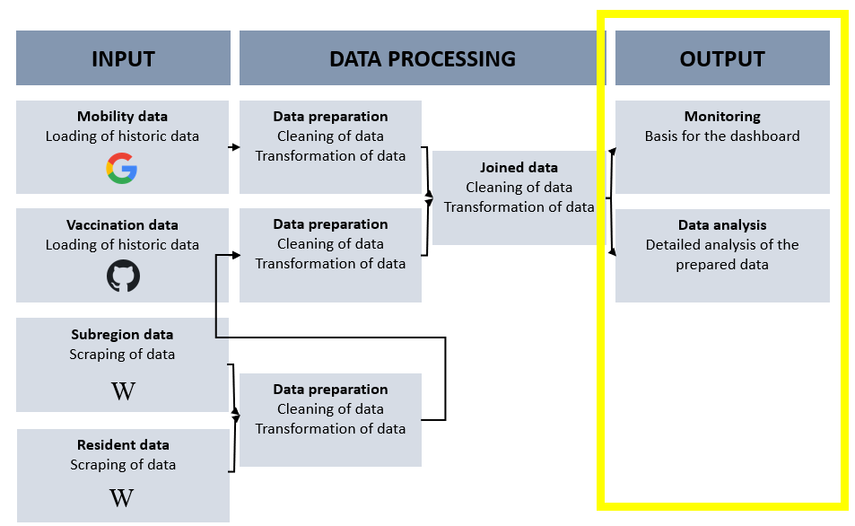

```{r setup, include=FALSE}
knitr::opts_chunk$set(echo = TRUE)
```

# Konzeptionelles Vorgehen {.sidebar}




__Abbildung 1__: Konzeptionelles Vorgehen, Eigene Darstellung 2021

# Notwendige Pakete laden

Die folgenden Pakete werden für dieses Notebook benötigt:

```{r import packages, message=FALSE}
library(tidyverse)
library(ggplot2) #Visualisierung
```

# Daten importieren

```{r import data}

mobility_vaccine <- read.csv("../Website/Daten_Output/Mobility_vaccine.csv")
```
