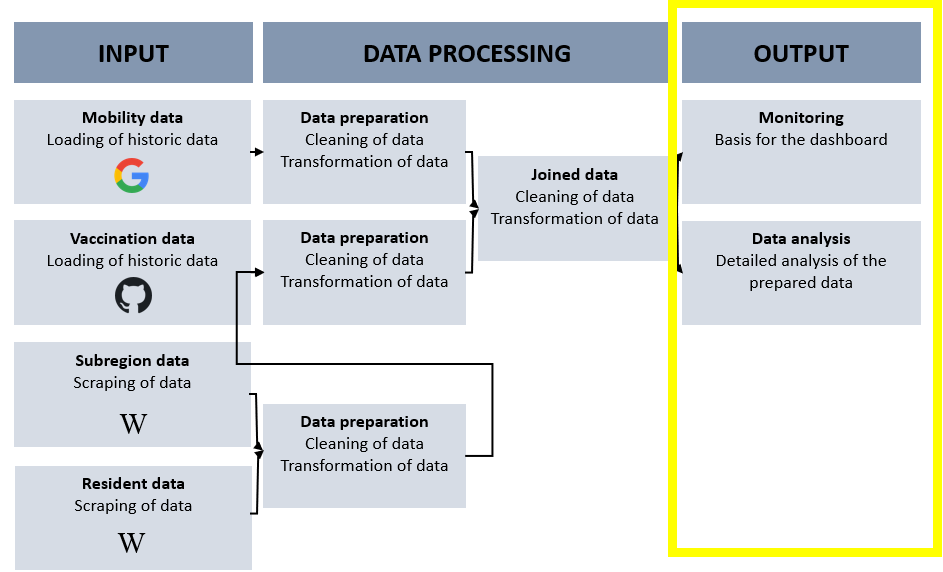

```{r setup, include=FALSE}
knitr::opts_chunk$set(echo = TRUE)
```

# Konzeptionelles Vorgehen {.sidebar}




__Abbildung 1__: Konzeptionelles Vorgehen, Eigene Darstellung 2021

# Notwendige Pakete laden

Für dieses Notebook werden die folgenden Pakete benötigt:

```{r import packages, message=FALSE}
library(tidyverse)
library(ggplot2) #Visualisierung
library(plotly)
library(scales)
library(lubridate)
library(DT)
```

# Daten importieren

Der im Abschnitt __Datenintegration__ erstellte Datensatz _mobility_vaccine_ wird für dieses Notebook __Datenanalyse__ herangezogen.

```{r import_data}
mobility_vaccine <- read.csv("../Website/Daten_Output/Mobility_vaccine.csv")
```

## Beschreibung des finalen Datensatzes

```{r describe_data}
glimpse(mobility_vaccine)
```

```{r delete_columns}
excluded_vars <- c("X", "country_region_code", "country_region", "iso_code")

mobility_vaccine <- select(mobility_vaccine, -excluded_vars)
```

```{r describe_column_number}
no_cols<- ncol(mobility_vaccine)
```

```{r describe_row_number}
no_rows<- nrow(mobility_vaccine)
```

Der finale Datensatz __mobility_vaccine__ besteht aus `r no_cols` Spalten und `r no_rows` Zeilen. In der folgenden Tabelle werden die Variablen beschrieben sowie ihre Merkmale benannt.


| Variable            | Beschreibung    |
| ------------------- |:---------------:|
|date  |Datum        |
|bundesland       |Bundesland|
|ID         |Bundesland_ID     |
|Impfstoff         |Impfstoff verwendet|
|Impfserie           |Serie Impfstoff verwendet|
|Anzahl      |Anzahl Impfungen pro Tag|
|Einwohner_2020     |Einwohnerzahl pro Bundesland|
|retail_and_recreation|Einzelhandel und Erholung|
|grocery_and_pharmacy|Lebensmittel und Apotheken|
|parks | Park (z.B.: Öffentlicher Park, Schloss, Waldgebiete|
|transit_stations |Transitstationen|
|workplaces |Arbeitsstätten|
|residential |Haus und Wohnungen|


Im nächsten Schritt wird geprüft ob der Datensatz fehlende Elemente besitzt.

```{r, results=FALSE}
is.na(mobility_vaccine)
```

Die Spalte ___date__ wird dupliziert damit im weiteren Vorgehen drei neue Spalten __Year__, __Month__ und __Date__ erstellt werden können. Diese Anpassung erfolgt zur Vereinfachung der Aggregierung.

```{r}
mobility_vaccine$date <- ymd(mobility_vaccine$date)
```


```{r}
mobility_vaccine <- mobility_vaccine %>% 
                mutate(date_2 = date)
```

An der Stelle __-__ wird die Spalte __date_2__ gesplittet.

```{r}
mobility_vaccine <- mobility_vaccine %>% 
   separate(date_2, c("Year", "Month", "Day"), sep="-")%>% 
            unite(year_month, c(Year, Month), sep = "/", remove = FALSE)
```

Zur weiteren Analyse wird im nächsten Schritt eine zusätzliche Spalte mit der Bezeichnung __year_month__ erstellt. Somit können Visualisierungen für den gesamten Zeitraum auf monatsebene erstellt werden.

Da der Impfstoff __Janssen__ nach einer einmaligen Impfung den vollen Impfstoff bietet, werden die weiteren Impfstoffe (mind. 2 Impfungen Stand heute) durch 2 geteilt. Somit kann der Impffortschritt besser verglichen werden.

```{r}
mobility_vaccine <-mobility_vaccine  %>%
  mutate(impf_fortschritt = case_when(Impfstoff == "Comirnaty" ~ Anzahl/2,
                                      Impfstoff == "AstraZeneca" ~ Anzahl/2,
                                      Impfstoff == "Moderna" ~ Anzahl/2,
                                      Impfstoff == "Janssen" ~ Anzahl*1))
```

```{r}
mobility_vaccine <-mobility_vaccine  %>%
  mutate(impf_quote = (impf_fortschritt/Einwohner_2020)*100)
```


```{r, echo = TRUE,fig.width = 10,fig.height = 8, warning=FALSE}
mobility_vaccine_head <- mobility_vaccine%>% slice(1:50)

datatable(mobility_vaccine_head) %>% 
  formatDate('date', 'toDateString') %>% 
  formatCurrency(c('retail_and_recreation','grocery_and_pharmacy', 'parks', 'transit_stations', 'workplaces', 'residential'), '%') %>% 
  formatPercentage('impf_quote',2)
  
  
```

## Analyse des finalen Datensatzes

### Betrachtungszeitraum

Der Zeitraum der Betrachtung der Daten ist ab dem 27.12.2020 bis zum 15.10.2021.

```{r}
mobility_vaccine %>% 
    select(date) %>% 
    summarise(max = max(date, na.rm = TRUE), min = min(date, na.rm = TRUE))
```


### Deutschland Impfung gesamt


```{r}
summe_impfungen_gesamt <-mobility_vaccine %>%
              summarise(
              sum_impfungen = sum(Anzahl))
summe_impfungen_gesamt
```

In dem Zeitraum vom 27.12.2020 bis 15.10.2021 wurden in Deutschland  `r summe_impfungen_gesamt` Impfungen verabreicht.


### Deutschland Impfung pro Jahr

In 2020 wurden in Summe 207060 Impfungen verabreicht während in 2021 bis zum 15.10.2021 in Summe 109.314.592 Impfungen verabreicht wurden (inkl. Zweitimpfung).

```{r, echo = TRUE,fig.width = 5,fig.height = 4, warning=FALSE}
graph_1 <- mobility_vaccine %>%
  group_by(Year) %>% 
  summarise(summe_pro_jahr = sum(Anzahl)) %>% 
  ggplot(aes(x = Year, y = summe_pro_jahr))+
  geom_col(size=1.2, colour="darkslategray", fill = "darkslategray4")+
  theme_classic()+
  scale_y_continuous(labels = function(x) format(x, big.mark = ".",
                                                scientific = FALSE)) +
  labs(
    title = "Covid Impfungen pro Jahr",
    subtitle = "Impfungen gesamt",
    y = element_blank(),
    x = element_blank()
  )

ggplotly(graph_1)
```

### Welcher Impfstoff wurde am häufigsten verabreicht?

Der Impfstoff __Biontech/Comirnaty__ wurde in Summe am häufigsten verabreicht (84.047.591). Von dem Impfstoff __AstraZeneca__ wurden 12.670.077 Dosen geimpft, __Moderna__ folgt mit 9.553.672 Impfungen und __Janssen__ mit 3.250.312 Dosen.

```{r}
mobility_vaccine %>%
  group_by(Impfstoff) %>% 
  summarise(summe_impfungen = sum(Anzahl)) %>% 
  arrange(desc(summe_impfungen))
```


```{r, echo = TRUE,fig.width = 5,fig.height = 4, warning=FALSE}
graph_2 <-mobility_vaccine %>%
  group_by(Year, Impfstoff) %>%
  summarise(Impfungen = sum(Anzahl)) %>% 
  ggplot(aes(x = Year, y = Impfungen, group = Impfstoff, colour = Impfstoff, fill = Impfstoff))+
  geom_col(size=1.2)+ 
  scale_y_continuous(labels = function(x) format(x, big.mark = ".",
                                                scientific = FALSE))+
  theme_minimal()+
  labs(
    title = "Covid Impfungen pro Jahr",
    subtitle = "Impfungen nach Impfstoff",
    y = element_blank(),
    x = element_blank()
  )
ggplotly(graph_2)
```

### Impfungen zeitlicher Verlauf (pro Monat & Jahr)

Mit Hilfe der folgenden Funktion wird die Anzahl der Impfungen pro Monat aufgezeigt. 


```{r, echo = TRUE,fig.width = 8,fig.height = 6, warning=FALSE}
graph_3 <-mobility_vaccine %>%
  group_by(year_month) %>%
  summarise(Impfungen = sum(Anzahl)) %>% 
  ggplot(aes(x = year_month, y = Impfungen))+
  geom_col(size=1.2, colour="darkslategray", fill = "darkslategray4")+ 
  scale_y_continuous(labels = function(x) format(x, big.mark = ".",
                                                scientific = FALSE))+
  theme_minimal()+
  theme(axis.text.x = element_text(angle = 90, vjust = 0.5, hjust=1))+
  labs(
    title = "Covid Impfungen pro Jahr",
    subtitle = "Impfungen nach Impfstoff",
    y = element_blank(),
    x = element_blank()
  )

ggplotly(graph_3)
```

### Deutschland Impfung pro Bundesland

```{r, echo = TRUE,fig.width = 8,fig.height = 6, warning=FALSE}
graph_4 <-mobility_vaccine %>%
  group_by(Bundesland) %>%
  summarise(sum_impfungen = sum(Anzahl), 
    min_anzahl = min(Anzahl),
    mean_anzahl = mean(Anzahl)) %>% 
  ggplot(aes(x = reorder(Bundesland, -sum_impfungen), y = sum_impfungen))+
  geom_col(size=1.2, colour="darkslategray", fill = "darkslategray4")+ 
  scale_y_continuous(labels = function(x) format(x, big.mark = ".",
                                                scientific = FALSE))+
  theme_minimal()+
  theme(axis.text.x = element_text(angle = 90, vjust = 0.5, hjust=1))+
  labs(
    title = "Covid Impfungen pro Jahr",
    subtitle = "Impfungen nach Impfstoff",
    y = element_blank(),
    x = element_blank()
  )


ggplotly(graph_4)
```

```{r}
mobility_vaccine %>%
  group_by(Bundesland) %>%
  summarise(
    sum_impfungen = sum(Anzahl), 
    min_anzahl = min(Anzahl),
    mean_anzahl = mean(Anzahl)
  ) %>% 
  arrange(desc(sum_impfungen))
```


### Einwohner pro Bundesland

```{r}
mobility_vaccine %>%
  distinct(Bundesland, Einwohner_2020) %>% 
  arrange(desc(Einwohner_2020))
```

```{r, echo = TRUE,fig.width = 8,fig.height = 6, warning=FALSE}
 graph_5<-mobility_vaccine %>%
  group_by(Bundesland) %>%
  summarise(Einwohner = min(Einwohner_2020)) %>% 
  ggplot(aes(x = reorder(Bundesland, -Einwohner), y = Einwohner))+
  geom_col(size=1.2, colour="darkslategray", fill = "darkslategray4")+ 
  scale_y_continuous(labels = function(x) format(x, big.mark = ".",
                                                scientific = FALSE))+
  theme_minimal()+
  theme(axis.text.x = element_text(angle = 90, vjust = 0.5, hjust=1))+
  labs(
    title = "Covid Impfungen pro Jahr",
    subtitle = "Impfungen nach Impfstoff",
    y = element_blank(),
    x = element_blank()
  )


ggplotly(graph_5)
```


## Impfquote


```{r, echo = TRUE,fig.width = 8,fig.height = 6, warning=FALSE}
graph_6 <- mobility_vaccine %>%
  group_by(Bundesland) %>% 
  summarise(quote = sum(impf_quote)) %>%  
  ggplot(aes(x = reorder(Bundesland, -quote), y = quote))+
  geom_col(size=1.2, colour="darkslategray", fill = "darkslategray4")+
  scale_y_continuous(labels = comma_format(big.mark = ".",
                                          decimal.mark = ","))+
  theme_minimal()+
  theme(axis.text.x = element_text(angle = 90, vjust = 0.5, hjust=1))+
  labs(
    title = "Covid Impfungen pro Jahr",
    subtitle = "Impfungen nach Impfstoff",
    y = "Impfquote [%]",
    x = element_blank()
  )+
  ylim(0,100)

ggplotly(graph_6)
```


```{r, echo = TRUE,fig.width = 8,fig.height = 6, warning=FALSE}
graph_7 <-mobility_vaccine %>%
  group_by(year_month, Impfstoff) %>%
  summarise(Impfungen = sum(Anzahl)) %>% 
  ggplot(aes(x = year_month, y = Impfungen, group = Impfstoff, colour = Impfstoff, fill = Impfstoff))+
  geom_col()+ 
  scale_y_continuous(labels = comma_format(big.mark = ".",
                                          decimal.mark = ","))+
  theme_minimal()+
  theme(axis.text.x = element_text(angle = 90, vjust = 0.5, hjust=1))

ggplotly(graph_7)
```


## Retail and recreation gesamt

```{r}
ggplot(mobility_vaccine, aes(x = year_month, y = retail_and_recreation)) +
  geom_point()
```

```{r}


ggplot(mobility_vaccine, aes(x = year_month, y = retail_and_recreation, fill = Bundesland, color = Bundesland)) +
  geom_point()
```


## grocery and pharmacy gesamt

```{r}
ggplot(mobility_vaccine, aes(x = year_month, y = grocery_and_pharmacy)) +
  geom_point()
```

```{r}
ggplot(mobility_vaccine, aes(x = year_month, y = grocery_and_pharmacy, fill = Bundesland, color = Bundesland)) +
  geom_point()
```

## parks

```{r}
ggplot(mobility_vaccine, aes(x = year_month, y = parks)) +
  geom_point()
```

```{r}
ggplot(mobility_vaccine, aes(x = year_month, y = parks, fill = Bundesland, color = Bundesland)) +
  geom_point()
```

## transit_stations

```{r}
ggplot(mobility_vaccine, aes(x = year_month, y = transit_stations)) +
  geom_point()
```

```{r}
ggplot(mobility_vaccine, aes(x = year_month, y = transit_stations, fill = Bundesland, color = Bundesland)) +
  geom_point()
```

## workplaces

```{r}
ggplot(mobility_vaccine, aes(x = year_month, y = workplaces)) +
  geom_point()
```

```{r}
ggplot(mobility_vaccine, aes(x = year_month, y = workplaces, fill = Bundesland, color = Bundesland)) +
  geom_point()
```

## residential

```{r}
ggplot(mobility_vaccine, aes(x = year_month, y = residential)) +
  geom_point()
```

```{r}
ggplot(mobility_vaccine, aes(x = year_month, y = residential, fill = Bundesland, color = Bundesland)) +
  geom_point()
```


### Mobilitätsaufkommen vs Impfungen


```{r}
mobility_vaccine %>%
  group_by(date) %>% 
  summarise(max = mean(retail_and_recreation),
            sum = sum(Anzahl)) %>% 
  summarise(max = max,
            sum = cumsum(sum),
            date = date) %>% 
  ggplot()+
  geom_line(aes(x = date, y = max), size = 0.8, color = "darkslategray")+
  geom_line(aes(x = date, y = sum/1000000), size = 0.8, color = "darkslateblue")+
  geom_point(aes(x = date, y = sum/1000000), size = 0.8, color = "darkslateblue")+
  geom_hline(yintercept=0, linetype="dashed", color = "grey")+
  scale_y_continuous(sec.axis = sec_axis(~.*1,name = "Anzahl Impfungen kumuliert [Mio]"))+
  scale_x_date(labels = date_format("%b %y"),
               date_breaks = ("2 weeks"))+
  theme_classic()+
  theme(axis.text.x = element_text(angle = 90, vjust = 0.5, hjust=1))+
  labs(
    title = "Mobilitätsaufkommen vs Impfverlauf",
    subtitle = "An Orten wie Einzelhandel und Erholung",
    y = "Abweichung zum Rezerenzwert [%]"
  )

```


```{r}
mobility_vaccine %>%
  group_by(date) %>% 
  summarise(max = mean(grocery_and_pharmacy),
            sum = sum(Anzahl)) %>% 
  summarise(max = max,
            sum = cumsum(sum),
            date = date) %>% 
  ggplot()+
  geom_line(aes(x = date, y = max), size = 0.8, color = "darkslategray")+
  geom_line(aes(x = date, y = sum/1000000), size = 0.8, color = "darkslateblue")+
  geom_point(aes(x = date, y = sum/1000000), size = 0.8, color = "darkslateblue")+
  geom_hline(yintercept=0, linetype="dashed", color = "grey")+
  scale_y_continuous(sec.axis = sec_axis(~.*1,name = "Anzahl Impfungen kumuliert [Mio]"))+
  scale_x_date(labels = date_format("%b %y"),
               date_breaks = ("2 weeks"))+
  theme_classic()+
  theme(axis.text.x = element_text(angle = 90, vjust = 0.5, hjust=1))+
  labs(
    title = "Mobilitätsaufkommen vs Impfverlauf",
    subtitle = "An Orten wie Einzelhandel und Erholung",
    y = "Abweichung zum Rezerenzwert [%]"
  )

```

```{r}
mobility_vaccine %>%
  group_by(date) %>% 
  summarise(max = mean(parks),
            sum = sum(Anzahl)) %>% 
  summarise(max = max,
            sum = cumsum(sum),
            date = date) %>% 
  ggplot()+
  geom_line(aes(x = date, y = max), size = 0.8, color = "darkslategray")+
  geom_line(aes(x = date, y = sum/1000000), size = 0.8, color = "darkslateblue")+
  geom_point(aes(x = date, y = sum/1000000), size = 0.8, color = "darkslateblue")+
  geom_hline(yintercept=0, linetype="dashed", color = "grey")+
  scale_y_continuous(sec.axis = sec_axis(~.*1,name = "Anzahl Impfungen kumuliert [Mio]"))+
  scale_x_date(labels = date_format("%b %y"),
               date_breaks = ("2 weeks"))+
  theme_classic()+
  theme(axis.text.x = element_text(angle = 90, vjust = 0.5, hjust=1))+
  labs(
    title = "Mobilitätsaufkommen vs Impfverlauf",
    subtitle = "An Orten wie Einzelhandel und Erholung",
    y = "Abweichung zum Rezerenzwert [%]"
  )

```

```{r}
mobility_vaccine %>%
  group_by(date) %>% 
  summarise(max = mean(transit_stations),
            sum = sum(Anzahl)) %>% 
  summarise(max = max,
            sum = cumsum(sum),
            date = date) %>% 
  ggplot()+
  geom_line(aes(x = date, y = max), size = 0.8, color = "darkslategray")+
  geom_line(aes(x = date, y = sum/1000000), size = 0.8, color = "darkslateblue")+
  geom_point(aes(x = date, y = sum/1000000), size = 0.8, color = "darkslateblue")+
  geom_hline(yintercept=0, linetype="dashed", color = "grey")+
  scale_y_continuous(sec.axis = sec_axis(~.*1,name = "Anzahl Impfungen kumuliert [Mio]"))+
  scale_x_date(labels = date_format("%b %y"),
               date_breaks = ("2 weeks"))+
  theme_classic()+
  theme(axis.text.x = element_text(angle = 90, vjust = 0.5, hjust=1))+
  labs(
    title = "Mobilitätsaufkommen vs Impfverlauf",
    subtitle = "An Orten wie Einzelhandel und Erholung",
    y = "Abweichung zum Rezerenzwert [%]"
  )

```

```{r}
mobility_vaccine %>%
  group_by(date) %>% 
  summarise(max = mean(workplaces),
            sum = sum(Anzahl)) %>% 
  summarise(max = max,
            sum = cumsum(sum),
            date = date) %>% 
  ggplot()+
  geom_line(aes(x = date, y = max), size = 0.8, color = "darkslategray")+
  geom_line(aes(x = date, y = sum/1000000), size = 0.8, color = "darkslateblue")+
  geom_point(aes(x = date, y = sum/1000000), size = 0.8, color = "darkslateblue")+
  geom_hline(yintercept=0, linetype="dashed", color = "grey")+
  scale_y_continuous(sec.axis = sec_axis(~.*1,name = "Anzahl Impfungen kumuliert [Mio]"))+
  scale_x_date(labels = date_format("%b %y"),
               date_breaks = ("2 weeks"))+
  theme_classic()+
  theme(axis.text.x = element_text(angle = 90, vjust = 0.5, hjust=1))+
  labs(
    title = "Mobilitätsaufkommen vs Impfverlauf",
    subtitle = "An Orten wie Einzelhandel und Erholung",
    y = "Abweichung zum Rezerenzwert [%]"
  )

```

```{r}
mobility_vaccine %>%
  group_by(date) %>% 
  summarise(max = mean(residential),
            sum = sum(Anzahl)) %>% 
  summarise(max = max,
            sum = cumsum(sum),
            date = date) %>% 
  ggplot()+
  geom_line(aes(x = date, y = max), size = 0.8, color = "darkslategray")+
  geom_line(aes(x = date, y = sum/1000000), size = 0.8, color = "darkslateblue")+
  geom_point(aes(x = date, y = sum/1000000), size = 0.8, color = "darkslateblue")+
  geom_hline(yintercept=0, linetype="dashed", color = "grey")+
  scale_y_continuous(sec.axis = sec_axis(~.*1,name = "Anzahl Impfungen kumuliert [Mio]"))+
  scale_x_date(labels = date_format("%b %y"),
               date_breaks = ("2 weeks"))+
  theme_classic()+
  theme(axis.text.x = element_text(angle = 90, vjust = 0.5, hjust=1))+
  labs(
    title = "Mobilitätsaufkommen vs Impfverlauf",
    subtitle = "An Orten wie Einzelhandel und Erholung",
    y = "Abweichung zum Rezerenzwert [%]"
  )

```


