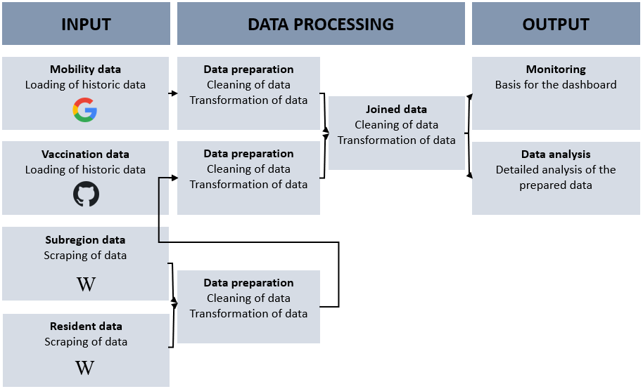
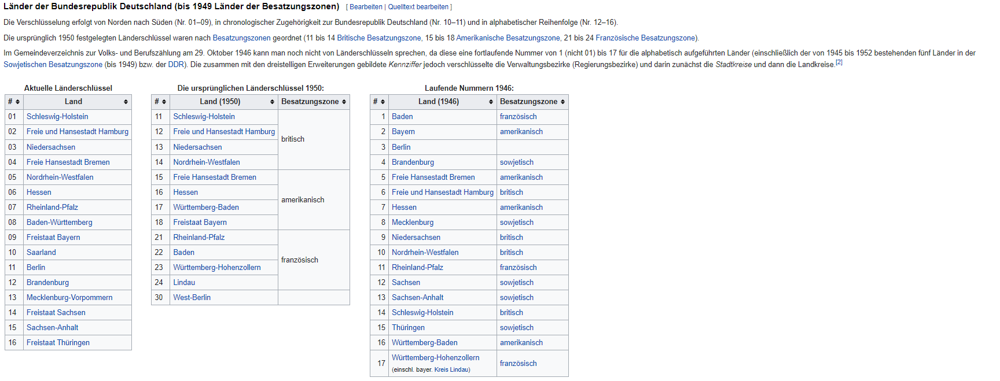
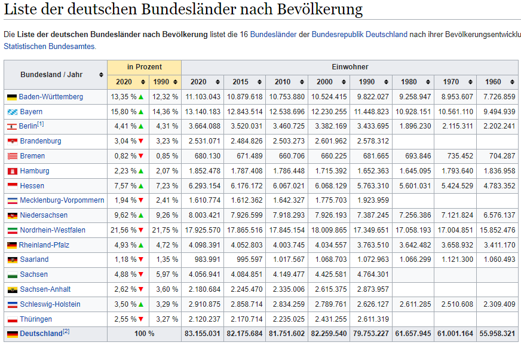
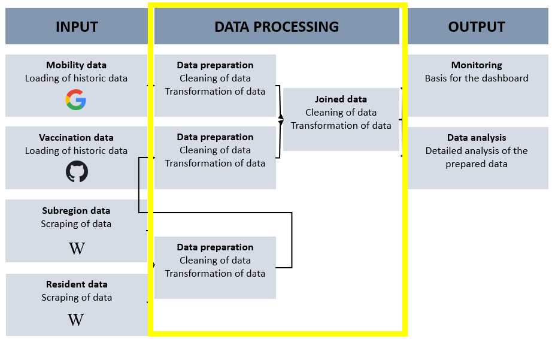

```{r setup, include=FALSE}
knitr::opts_chunk$set(echo = TRUE)
```

# Einleitung {.sidebar}

Im folgenden Notebook werden die in diesem Projekt verwendeten Daten beschrieben und für die weitere Verarbeitung bereinigt und vorbereitet.

# Konzeptionelles Vorgehen

Das Ziel dieses Projekts ist es die Daten zu analysieren sowie ein Dashboard zum Monitoring für das Impfen zu erstellen. Das Vorgehen ist wie in der Abbildung 1 beschrieben. Die Daten liegen in unterschiedlichen Quellen zur Verfügung. Google stellt die Mobilitätsdaten als .csv bereit. Die Impfdaten werden von dem Projekt "Digitales Impfquoten-Monitoring" (DIM) in GitHub zur Verfügung gestellt und stehen somit auch als .csv zur Verfügung.

Um mit den Daten arbeiten zu können, müssen diese im weiteren Vorgehen zusammengeführt werden. Hierzu benötigt es weitere Daten. Diese Daten werden von unterschiedlichen Wikipedia Seiten gescraped. Sobald alle Daten vorliegen werden diese in das Notebook geladen, überprüft und zur weiteren Verarbeitung bereinigt und vorbereitet.



__Abbildung 1__: Konzeptionelles Vorgehen, Eigene Darstellung 2021

# Notwendige Pakete laden

Die folgenden Pakete werden für dieses Notebook benötigt:

```{r import packages, message=FALSE}
library(tidyverse)
library(ggplot2) #Visualisierung
library(rvest) #Web scraping
library(robotstxt)
```

# Datenbeschaffung und Beschreibung

## Mobilitätsdaten (Datensatz 1) 

Google liefert mit dem Datensatz „Mobilitätsbericht“ Informationen dazu, was sich durch die Regelungen 
zur Bekämpfung der Coronakrise hinsichtlich dem Mobilitätsaufkommen geändert hat. In den 
Mobilitätsberichten werden Bewegungstrends nach Region (Bundesland) für verschiedene Kategorien 
dargestellt. Sie zeigen Änderungen für jede Kategorie in einer Region auf. Es wird die Mobilität am Tag 
des Berichts mit der des Referenztags verglichen und die Veränderung wird in Prozent aufgezeigt. Ein 
Referenztag repräsentiert einen normalen Wert für den entsprechenden Wochentag. Der Referenztag 
ist der Medianwert der fünf Wochen vom 3. Januar bis 6. Februar 2020.
Alle Mobilitätsberichte sind nach Orten aufgeschlüsselt und zeigen, wie sich die Zahl der Besuche an 
Orten wie zum Beispiel Lebensmittelgeschäften und Parks verändert hat. Die Daten von Google stehen 
unter dem folgenden [Link](https://www.google.com/covid19/mobility/?hl=de) zur Verfügung.

### Beschreibung der Variablen


| Variable            | Beschreibung    |  
| ------------------- |:---------------:|
|Country region code  |ISO Code         |
|Country region       |Land             |
|sub_region_1         |Bundesland       |
|sub_region_2         |Bundesland Zusatz|
|metro_area           |Keine Einträge|
|iso_3166_2_code      |Keine Einträge|
|census_fips_code     |Keine Einträge|
|place_id             |tbd|
|date                 |Datum|
|retail_and_recreation|Einzelhandel und Erholung|
|grocery_and_pharmacy|Lebensmittel und Apotheken|
|parks | Park (z.B.: Öffentlicher Park, Schloss, Waldgebiete|
|transit_stations |Transitstationen|
|workplaces |Arbeitsstätten|
|residential |Haus und Wohnungen|

## Impfdaten (Datensatz 2)

Die COVID-19-Impfung kann einen Wendepunkt in der Kontrolle der COVID-19-Pandemie darstellen und erfährt daher hohes Maß an öffentlicher Aufmerksamkeit. Einführung und Umsetzung der COVID-19-Impfung gehen mit besonderen Herausforderungen einher, die bei der Impfdatenerfassung zu berücksichtigen sind.

In diesem Kontext ist es Ziel des Projekts "Digitales Impfquoten-Monitoring" (DIM), tagesaktuell und bundesweit die Impfquote zu erfassen und aufbereitet darzustellen. Die Daten stehen 
unter dem folgenden [Link](https://github.com/robert-koch-institut/COVID-19-Impfungen_in_Deutschland) zur Verfügung.

### Beschreibung der Variablen

| Variable      | Beschreibung  |  
| ------------- |:-------------:|
| Impfdatum     | Impfdatum|
| BundeslandID_Impfort| ID 1-16|
| Impfstoff| Name Impfstoff|
| Impfserie|Serie der Impfung|
| Anzahl|Anzahl Geimpfte Personen|

## Bundesland_ID (Anreicherung der Daten)

Da in dem Datensatz der Mobilitätsdaten das Bundesland gegeben ist und in dem Datensatz der Impfdaten lediglich die Bundesland ID gegeben ist, wird zur Zusammenführung dieser beider Datensätze eine Anreicherung der Daten benötigt. Diese Anreicherung ist die Zuordnung der ID zum Bundesland. Die Daten stehen unter dem folgenden Link zur Verfügung: [Link](https://de.wikipedia.org/wiki/Amtlicher_Gemeindeschl%C3%BCssel).

### Beschreibung der Variablen

| Variable      | Beschreibung  |  
| ------------- |:-------------:|
| ID            |ID 1-16        |
| Bundesland    |Name Bundesland|


### Webscraping Länderschlüssel

In diesem Abschnitt wird die **Bundesland ID** mit Hilfe von Webscraping aus **Wikipedia** extrahiert. Es gibt eine eigene Wikipediaseite für amtliche Gemeindeschlüssel. Hier befindet sich in der ersten Tabelle die aktuellen Länderschlüssel mit den jeweiligen Bundesländern (Abbildung 2).



__Abbildung 2__: Amtliche Länderschlüssel, Wikipedia 2021

Zuerst wird mit der Funktion paths_allowed überprüft ob Informationen der Seite gescraped werden dürfen.

```{r, message=FALSE}
paths_allowed("de.wikipedia.org")
```

Der nächste Schritt ist die Zuweisung der URL und die Identifikation des XPaths. Hierzu wird die Tabelle auf der Seite untersucht. 

```{r , message=FALSE}
url = "https://de.wikipedia.org/wiki/Amtlicher_Gemeindeschl%C3%BCssel"
```

Im weiteren Vorgehen wird die Extraktionsfunktion definiert, der gescrapte Inhalt als tibble abgelegt und entsprechend der Variablennamen angepasst.
```{r , message=FALSE}
scraping <- url %>%
  read_html() %>%
  html_node(xpath = '//*[@id="mw-content-text"]/div[1]/table/tbody/tr/td[1]/table') %>%
  html_table(fill = TRUE)
```

```{r , message=FALSE}
scraping <- scraping %>%
    as_tibble()
```

```{r, message=FALSE}
scraping <- 
    scraping %>%
    rename(
    ID = "#",
    Bundesland = "Land"
    )
```

Die Tabelle wird als .csv für die weitere Verarbeitung gespeichert.

```{r , message=FALSE}
write_csv(scraping,"../Website/Daten_Input/Mapping.csv")
```


## Anzahl Einwohner pro Bundesland (Anreicherung der Daten)

### Beschreibung der Variablen

| Variable      | Beschreibung  |  
| ------------- |:-------------:|
| ID            |ID 1-16        |
| Bundesland    |Name Bundesland|

### Webscraping

In diesem Abschnitt wird die **Anzahl der Einwohner pro Bundesland** mit Hilfe von Webscraping aus **Wikipedia** extrahiert. Es gibt eine eigene Wikipediaseite für die Bevölkerungszahlen. Hier befindet sich eine Tabelle welche die Einwohnerzahlen pro Bundesland abbildet (Abbildung 3). Die für uns interessanten Daten sind lediglich die aktuellsten Bevölerungszahlen sowie die Zuordnung zu den Bundesländern. Deshalb wird im weiteren Verlauf das Crawling sowie die entsprechende Datenbereinigung durchgeführt. Weil sich das Scraping vom vorherigen Vorgehen nicht unterscheidet wird es im weiteren Verlauf nicht genauer beschrieben.



__Abbildung 3:__ Bevölerungszahlen, Wikipedia 2021


```{r , message=FALSE}
url_second = "https://de.wikipedia.org/wiki/Liste_der_deutschen_Bundesl%C3%A4nder_nach_Bev%C3%B6lkerung"
```

```{r , message=FALSE}
#scraping_second <- url_second %>%
#  read_html() %>%
#  html_node(xpath = '//*[@id="mw-content-text"]/div[1]/table/thead') %>%
#  html_table(fill = TRUE)
```


```{r, message=FALSE}
#scraping_second <- scraping_second %>%
#      as_tibble()
```


```{r, message=FALSE}
#write_csv(scraping_second,"../Website/Daten_Input/Bundesland_Einwohner.csv")
```

```{r}
anzahl <- read.csv("../Website/Daten_Input/Bundesland_Einwohner.csv", sep = ",")
```

```{r}
glimpse(anzahl)
```

So wie die Daten nach dem Scraping vorliegen, kann damit noch nicht gearbeitet werden. Im folgenden Abschnitt wird die Bereinigung der Daten beschrieben. 

Als ersten Schritt werden die gewünschten Spalten in __Einwohner_2020__ und __Bundesland__ umbenannt und zur weiteren Bearbeitung ausgewählt.

```{r}
anzahl <- anzahl %>% 
          rename(Einwohner_2020 = "Einwohner",
                 Bundesland = "Bundesland...Jahr") %>%
          select(Einwohner_2020, Bundesland)
```

```{r}
glimpse(anzahl)
```

Die erste Zeile enthält Informationen über die eigentlichen Spaltenüberschriften. Diese Zeile wird entfernt.

```{r}
anzahl <- anzahl[-1,]
```

Mit Hilfe von der Funktion __gsub__ werden alle ungewünschten Ausdrücke wie zum Beispiel "ü" identifiziert und ersetzt. Um die Spalteneinträge zu teilen wird ein __/__ eingefügt. Mit Hilfe dieses Satzzeichens wird im nächsten Schritt die Spalte entsprechend bereinigt.

```{r}
anzahl$Bundesland <- gsub('ü', 'ü', anzahl$Bundesland)
anzahl$Bundesland <- gsub('Â', '/', anzahl$Bundesland)
```

```{r, warning=FALSE}
anzahl <- anzahl %>% 
          separate(Bundesland, into=c('Bundesland', 'Bundesland2'), sep = '/', extra = "merge") %>% 
          select(Einwohner_2020, Bundesland) %>% 
          mutate_all(funs(gsub("\\.","",.)))
anzahl
```

Als letzten Schritt wird der Typ der Spalte __Einwohner_2020__ in __integer__ geändert.

```{r}
anzahl <- transform(anzahl, Einwohner_2020 = as.integer(Einwohner_2020))
```

```{r}
glimpse(anzahl)
```

```{r, message=FALSE}
write_csv(anzahl,"../Website/Daten_Output/Einwohnerzahl.csv")
```

# Daten importieren

## Mobilitätsdaten
```{r import data}

mobility_report <- read.csv("../Website/Daten_Input/Global_Mobility_Report.csv")
```

## Impfdaten
```{r}
vaccine_report <-  read.csv("../Website/Daten_Input/Aktuell_Deutschland_Bundeslaender_COVID-19-Impfungen.csv")
```

## Bundesland_ID

```{r}
id <- read.csv("../Website/Daten_Input/Mapping.csv", sep = ",")
```


## Einwohnerzahl

```{r}
population <- read.csv("../Website/Daten_Output/Einwohnerzahl.csv")
```

# Datenexploration

## Mobility_report

### Überblick über die Daten

```{r}
glimpse(mobility_report)
```

```{r}
no_cols<- ncol(mobility_report)
```

```{r}
no_rows<-nrow(mobility_report)
```

Die Mobilitätsdaten bestehen aus `r no_cols` Spalten und `r no_rows` Zeilen.

```{r, results=FALSE}
is.na(mobility_report)
```

Die Spalten __census_fips_code__, __sub_region_2__ und __metro_area__ haben keine Elemente.

### Analyse der Daten

```{r}
mobility_report %>% 
  select(date) %>% 
  summarise(max = max(date, na.rm = TRUE), min = min(date, na.rm = TRUE)) 
```

Der Zeitraum der Betrachtung liegt zwischen dem __15.02.2020__ und dem __19.10.2021__. Am 15.02.2021 lagen die ersten Mobilitätsdaten zur Auswertung vor. Am 19.10.2021 wurde für dieses Projekt der Datensatz abgerufen.

```{r}
no_country <- mobility_report %>% 
              count(country_region_code, sort = TRUE)
```

Es werden die Mobilitätsdaten von 135 Ländern in dem Datensatz betrachtet.

```{r}
top_country <- mobility_report %>% 
              count(country_region, sort = TRUE) %>% 
              slice(1:5)
```

Die Länder für die es am meisten Mobilitätsdaten gibt, also die meisten Tage aufgenommen wurden, sind USA, Brasilien, Indien, Türkei und Argentinien.

```{r}
mobility_report %>% 
  group_by(country_region) %>% 
  summarise(med=mean(retail_and_recreation_percent_change_from_baseline, na.rm = TRUE),
            min=min(retail_and_recreation_percent_change_from_baseline, na.rm = TRUE),
            max=max(retail_and_recreation_percent_change_from_baseline, na.rm = TRUE)) %>%
  arrange(desc(med)) %>% 
  slice(1:5)
```

Wird das Attribut "retail_and_recreation_percent_change_from_baseline" genauer betrachtet fällt auf, dass die Abweichung entgegen des Referenzwertes in den positiven Bereich sowie in den negativen Bereich in den Ländern Yemen, Libya, Niger, Afghanistan und Papua New Guinea sehr hoch ist. Das bedeutet, dass an bestimmten Tagen im Bereich Einzelhandel das Mobilitätsaufkommen sehr hoch entgegen des Referenzwertes oder sehr niedrig war.

```{r}
mobility_report %>% 
  group_by(country_region) %>% 
  summarise(med=mean(grocery_and_pharmacy_percent_change_from_baseline, na.rm = TRUE),
            min=min(grocery_and_pharmacy_percent_change_from_baseline, na.rm = TRUE),
            max=max(grocery_and_pharmacy_percent_change_from_baseline, na.rm = TRUE)) %>%
  arrange(desc(med)) %>% 
  slice(1:5)
```

Im Vergleich zu der Kategorie Einzelhandel und Freizeit ist in der Kategorie Lebensmittel und Apotheke die Verteilung für die Länder Libya, Mongolia, Ägypten, Burkina Faso und Yemen in den positiven Bereich höher. Bedeutet, dass das Mobilitätsaufkommen im Vergleich zum Referenzwert in den positiven Bereich stark abweicht und die Bewohner in dieser Kategorie trotz Corona vermehrt unterwegs waren.

```{r}
mobility_report %>% 
  group_by(country_region) %>% 
  summarise(med=mean(workplaces_percent_change_from_baseline, na.rm = TRUE),
            min=min(workplaces_percent_change_from_baseline, na.rm = TRUE),
            max=max(workplaces_percent_change_from_baseline, na.rm = TRUE)) %>%
  arrange(desc(med)) %>% 
  slice(1:5)
```

Ein anderes extrem ist bei der Kategorie Arbeitsstätte zu beobachten. Über den gesamten Betrachtungszeitraum scheint im Mittel die Anzahl der Besuche am Arbeitsplatz relativ gering bzw im negativen Bereich zu sein. Insbesondere in Burkina Faso scheint die Anzahl der Besuche zu Arbeitsstätten über den Betrachtungszeitraum hinweg einen negativen Trend zu haben.

```{r}
ggplot(mobility_report %>% 
         filter(country_region == "Yemen" | country_region == "Libya"| country_region == "Niger"| country_region == "Germany"), 
       aes(x = retail_and_recreation_percent_change_from_baseline)) + 
       geom_histogram(binwidth = 25) + 
        facet_wrap(~ country_region)


```

## Impfdaten

### Überblick über die Daten

```{r}
glimpse(vaccine_report)
```

```{r}
no_rows_vaccine<-nrow(vaccine_report)
```

```{r}
no_cols_vaccine<- ncol(vaccine_report)
```

Die Impfdaten bestehen aus `r no_cols_vaccine` Spalten und `r no_rows_vaccine` Zeilen. Der Datensatz enthält Informationen über das Impfdatum, das Bundesland in welchem die Impfung verabreicht wurde, den geimpften Impfstoff und die Serie aus welcher der Impfstoff vorliegt sowie die Anzahl der verabreichten Impfdosen.

```{r, results=FALSE}
is.na(vaccine_report)
```

Der Datensatz ist vollständig, keine Elemente fehlen in den Spalten.

### Analyse der Daten

```{r}
vaccine_report %>% 
  select(Impfdatum) %>% 
  summarise(max = max(Impfdatum, na.rm = TRUE), min = min(Impfdatum, na.rm = TRUE)) 
```

Bei den Impfdaten wird der Zeitraum vom 27.12.2020 bis zum 15.10.2021 betrachtet. Der Start des Zeitraums ist somit ca. 1 Jahr später was der Zeit zur Enticklung der Impfstoffe entspricht.

```{r}
vaccine_report %>% 
  count(BundeslandId_Impfort) 
```

Für 17 Bundesländer wurden die Impfdaten aufgenommen. Das 17te Bundesland ist in diesem Falls Deutschland. Hier konnte keine genaue Zuordnung gemacht werden. Zur weiteren Betrachtung wird diese ID nicht weiter berücksichtigt.

Im Datensatz sind die vier Impfstoffe aufgeführt:

```{r}
vaccine_report %>% 
  group_by(Impfstoff) %>% 
  summarise(sum = sum(Anzahl)) %>% 
  arrange(desc(sum))
```

Der häufigste Impfstoff ist __Comirnaty/Biontech__ gefolgt von __AstraZeneca__ und __Moderna__. Der Impfstoff mit den am wenigsten verabreichten Dosen ist __Janssen__. Bei dem Impfstoff __Janssen__ wird der Schutz bereits nach einer verabreichten Dosis erreicht. Daraus lässt sich der deutliche Unterschied zu den anderen Impfstoffen erklären.

Analysen bezogen auf die Bundesländer können erst nach den weiteren Schritten erfolgen. Da in dem Impfdatensatz lediglich die Bundesland ID gegeben ist:

```{r}
vaccine_report %>%
  group_by(BundeslandId_Impfort) %>% 
  summarise(sum = sum(Anzahl)) %>% 
  arrange(desc(sum))
```

# Datenbereinigung und Vorbereitung

Die Datenqualität ist der wichtigste Aspekt zur optimalen und fehlerfreien Auswertung der Daten. 
In dem folgenden Kapiteln wird sowohl die Bereinigung der beiden Datensätze als auch die Erstellung neuer, für die 
Datenauswertung relevanter Tabellen, schrittweise erläutert.

Im konzeptionellen Vorgehen befinden wir uns jetzt im zweiten Schritt __Data Processing__.



__Abbildung 4__: Konzeptionelles Vorgehen, Eigene Darstellung 2021

## Mobility_report

Da das Projektziel ist, Deutschland bei dem Impffortschritt zu unterstützen, wird als erstes nach dem __country_region_code__ gefiltert.

```{r}
mobility_germany <- mobility_report %>% 
          filter(country_region_code %in% c("DE"))
```

In Abschnitt 3 wurde identifieziert, dass die Variablen: "sub_region_2", "metro_area", "census_fips_code" keine Elemente enthalten. Die Variable "place_id" ist für die weitere Betrachtung nicht relevant. Aus diesem Grund werden diese Variablen aus dem Datensatz eliminiert:

```{r}
excluded_vars <- c("sub_region_2", "metro_area", "census_fips_code", "place_id")

mobility_germany <- select(mobility_germany, -excluded_vars)
```

Im nächsten Schritt wird überprüft ob alle Bundesländer in dem Datensatz enthalten sind und die gleiche Anzahl an Einträgen haben.

```{r}
mobility_germany %>% 
  group_by(sub_region_1) %>%
  count(sub_region_1)
```

Alle 16 Bundesländer sind im Datensatz enthalten. Im nächsten Schritt wird das __ü__ mit dem __ü__ ersetzt.

```{r}
mobility_germany$sub_region_1 <- gsub('ü', 'ü', mobility_germany$sub_region_1)
```

In dem Datensatz gibt es eine Zeile die keinem Bundesland zugeordnet ist. Hier sind die Werte für Deutschland hinterlegt. Da in dem Projekt auf Bundeslandebene gearbeitet wird kann diese Zeile entfallen.

```{r}
mobility_germany <- mobility_germany %>% 
      filter(sub_region_1 != "")
```

Im letzten Schritt werden die Variablennamen und die Bundeslandbezeichungen (Englisch in Deutsch) geändert:


```{r}
mobility_germany <- mobility_germany %>% 
      rename(iso_code = "iso_3166_2_code",
             retail_and_recreation = "retail_and_recreation_percent_change_from_baseline",
             grocery_and_pharmacy = "grocery_and_pharmacy_percent_change_from_baseline",
             parks = "parks_percent_change_from_baseline",
             transit_stations = "transit_stations_percent_change_from_baseline",
             workplaces = "workplaces_percent_change_from_baseline",
             residential = "residential_percent_change_from_baseline")
```

```{r}
mobility_germany <- mobility_germany %>% 
                    mutate(sub_region = case_when(sub_region_1 == "Bavaria" ~ "Bayern",
                                            sub_region_1 == "Lower Saxony" ~ "Niedersachsen",
                                            sub_region_1 == "North Rhine-Westphalia" ~ "Nordrhein-Westfalen",
                                            sub_region_1 == "Rhineland-Palatinate" ~ "Rheinland-Pfalz",
                                            sub_region_1 == "Saxony" ~ "Sachsen",
                                            sub_region_1 == "Saxony-Anhalt" ~ "Sachsen-Anhalt",
                                            sub_region_1 == "Thuringia" ~ "Thüringen",
                                            sub_region_1 == "Baden-Württemberg" ~ "Baden-Württemberg",
                                            sub_region_1 == "Berlin" ~ "Berlin",
                                            sub_region_1 == "Brandenburg" ~ "Brandenburg",
                                            sub_region_1 == "Bremen" ~ "Bremen",
                                            sub_region_1 == "Hamburg" ~ "Hamburg",
                                            sub_region_1 == "Hessen" ~ "Hessen",
                                            sub_region_1 == "Mecklenburg-Vorpommern" ~ "Mecklenburg-Vorpommern",
                                            sub_region_1 == "Saarland" ~ "Saarland",
                                            sub_region_1 == "Schleswig-Holstein" ~ "Schleswig-Holstein",
                                            )) 
```

```{r}
mobility_germany <- select(mobility_germany, - sub_region_1)
```

## Vaccine_report

Da beide Datensätze zusammengeführt werden, erfolgt im nächsten Schitt die Anpassung der Spaltennamen.

```{r}
vaccine_report <- vaccine_report %>% 
              rename(date = "Impfdatum",
                     ID = "BundeslandId_Impfort"
                     )
```

```{r}
names(vaccine_report)
```

Wie im dritten Abschnitt bereits beschrieben fehlt zur genauen Zuordnung der Bundesland ID der Bundeslandname. Hierfür wurde eine Mappingtabelle aus Wikipedia gescraped. Diese wird zur Zusammenführung ebenfalls vorbereitet.

```{r}
id$Bundesland <- gsub('ü', 'ü', id$Bundesland)
```

Die Bundeslandnamen weichen von den anderen Datensätzen ab. Deshalb werden die Bezeichnungen entsprechend angepasst:

```{r}
id <- id %>% 
            mutate(Bundesland = case_when(Bundesland == "Freistaat Bayern" ~ "Bayern",
                                          Bundesland == "Niedersachsen" ~ "Niedersachsen",
                                          Bundesland == "Nordrhein-Westfalen" ~ "Nordrhein-Westfalen",
                                          Bundesland == "Rheinland-Pfalz" ~ "Rheinland-Pfalz",
                                          Bundesland == "Freistaat Sachsen" ~ "Sachsen",
                                          Bundesland == "Sachsen-Anhalt" ~ "Sachsen-Anhalt",
                                          Bundesland == "Freistaat Thüringen" ~ "Thüringen",
                                          Bundesland == "Baden-Württemberg" ~ "Baden-Württemberg",
                                          Bundesland == "Berlin" ~ "Berlin",
                                          Bundesland == "Brandenburg" ~ "Brandenburg",
                                          Bundesland == "Freie Hansestadt Bremen" ~ "Bremen",
                                          Bundesland == "Freie und Hansestadt Hamburg" ~ "Hamburg",
                                          Bundesland == "Hessen" ~ "Hessen",
                                          Bundesland == "Mecklenburg-Vorpommern" ~ "Mecklenburg-Vorpommern",
                                          Bundesland == "Saarland" ~ "Saarland",
                                          Bundesland == "Schleswig-Holstein" ~ "Schleswig-Holstein",
                                          ))
```

Über einen __left join__ wird der Datensatz __vaccine_report__ und __id__ zusammengeführt und als __vaccine_report__ abgelegt:

```{r}
vaccine_report <- left_join(vaccine_report, id, by = c("ID"))
```

```{r überprüfung}
glimpse(vaccine_report)
```

Für die weitere Analyse wird die Anzahl der Einwohner pro Bundesland benötigt. Hierfür wurden die notwendigen Informationen über das Webscraping zur Verfügung gestellt. Im folgenden Abschnitt wird der Datensatz __population__ zu dem Datensatz __vaccine_report__ hinzugefügt:
```{r}
population$Bundesland <- gsub('ü', 'ü', population$Bundesland)
```

```{r}
vaccine_report <- left_join(vaccine_report, population, by = c("Bundesland"))
```

Der gewünschte Datensatz ist jetzt verfügbar und kann im nächsten Abschnitt mit den Mobilitätsdaten kombiniert werden.

```{r}
glimpse(vaccine_report)
```

## Zusammenführung der Datensätze

Die Zusammenführung der beiden Datensätze erfolgt über die Variablen __date__ und __Bundesland__ bzw. __sub_region__:

```{r}
mobility_vaccine <- merge(vaccine_report, mobility_germany, by.x=c("date", "Bundesland"), by.y=c("date", "sub_region"))
```


Der finale Datensatz wird als .csv gespeichert und abgelegt:

```{r}
write.csv(mobility_vaccine, "../Website/Daten_Output/Mobility_vaccine.csv")
```
