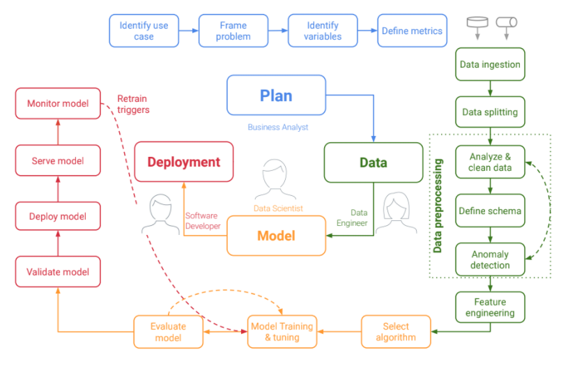
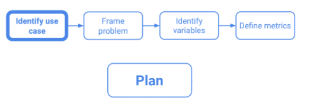
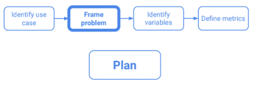
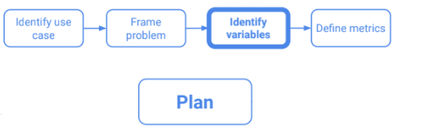

Bei dem Projektplan orientieren wir uns zum größten Teil an der Methodik, welche in der Vorlesung "Programming Languages for Data Science" eingeführt wurde. Das Vorgehen mittels der Methode wird im folgenden Abschnitt schrittweise erklärt.

# Use Case

Wir wurden von der Deutschen Regierung beauftragt bei der Kampagne für eine bessere Impfquote einen Beitrag zu leisten. Dieser bezieht sich auf die Identifikation von möglichen Standorten für Werbekampagnen. Unsere Aufgabe ist es, die Orte mit der höchsten Anzahl an ungeimpften Mitbürgern innerhalb Deutschlands zu identifizieren. Anhand dieser Identifikation können dann gezielt auf den jeweiligen Ort zugeschnittene Kampagnen gestartet werden.

Ziel soll sein eine Mappe von Deuschland zu generieren und die Veränderung von geimpften Personenaufkommen über die Zeit zu betrachten. Daraus lässt sich  ableiten welche die Orte sind, an denen das höchste Aufkommen von ungeimpften Personen ist. Da diese Orte ein großes Potential für die Verbreitung des COVID-Virus sind ist es wichtig die Impfquote an diesen zu erhöhen.

# Problemdefinition

## Zielpopulation
Die Zielpopulation sind alle Menschen in Deutschland. Wir versuchen zu verstehen an welchen Orten viele Menschen zusammen kommen und ob diese Menschen geimpft oder ungeimpft sind. Hierbei stützen wir uns auf die offiziellen Impfdaten vom DIM sowie den Mobilitätsreport bereitgestellt von Google.

## Zielfrage
Anhand der oben genannten Fragestellung versuchen wir herauszufinden welches der beste Standort für eine Werbekampagne der Regierung für eine Impfung ist. Die hierbei gewonnenen Daten können für die Entscheidung des Ortes genutzt werden, sowie für die gezielte Ausrichtung der Kampagne. In einem Jugendheim wird zum Beispiel eine andere Strategie benötigt als in einem Supermarkt. Anhand dieser Daten kann dann entschieden werden, wo die Werbekampagnen gestartet werden.

# Wichtige Variabeln

Die wichtigsten Variablen für dieses Projekt ist die Anzahl der geimpften Menschen sowie das Personenaufkommen in den einzelnen Regionen. Diese sind in folgende Unterkategorien unterteilt:

- parks

- retail and recreation

- grocery and pharmacy

- transit stations

- residential

- workplaces

Die Daten für die geimpften Personen liegen separiert pro Impfstoff vor. Für die Betrachtung spielt es jedoch keine Rolle welchen Impfstoff die Person erhalten hat.

