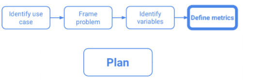

Bei dem Projektplan orienteiern wir uns zum größten Teil an dem verfahren welches in der Vorlesung "Programming Languages for Data Science" eingeführt wurde.

## Use Case

Wir wurden von der Deutschen Regierung beauftragt bei ihrer Kampagne für eine bessere Impfquote einen Beitrag zu leisten. Dieser bezieht sich auf die identifikation von möglichen Standorten für Werbekampagnen. Unsere Aufgabe ist es die Orte mit dem größten Aufkommen von ungeimpften innerhalb deutschlands zu identifizieren. Anhand dieser Identifikation können dann gezielt und auf den jeweiligen Ort zugeschnittene Kampagnen gestartet werden.

Ziel soll es sein eine Map von Deuschland zu haben und die Veränderung von geimpften und ungeimpften Personenaufkommen über die Zeit zu betrachten. Daraus lässt sich dann ableiten welche die Orte sind, andenen das höchste aufkommen von ungeimpften Personen stattfindet. Da diese Orte ein großes Potential für die Verbreitung des COVID-Virus sind ist es wichtig die Impfquote an diesen zu erhöhen.

## Problemdefinition

### Zielpopulation
Unsere Zielpopulation sind alle Menschen in Deutschland. Wir versuchen zu verstehen an welchen Orten viele Menschen zusammen kommen und ob diese Menschen geimpft oder ungeimpft sind. Hierbei stützen wir uns auf die offiziellen Impfdaten vom RKI sowie den Mobilitireport von Google.

### Zielfrage
Anhand der oben genannten Fragestellung versuchen wir herauszufinden welches der beste Standort für eine Werbekampagne der Regierung für eine Impfung ist. Die hierbei gewonnenen Daten können für die Entscheidung des Ortes genutzt werden, sowie für die gezielte Ausrichtung der Kampagne. In einem Jugendheim wird zum Beispiel eine andere Strategie benötigt als in einem Supermarkt. Anhand dieser Daten kann dann Entschieden werden wo die Werbekampaghnen gestartet werden.

## Wichtige Variabeln

Die wichtigste Variable für uns ist das Verhältnis von ungeimpften Menschen zum aufkommen an einem Standort.

## Metriken

soon...
