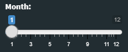
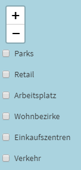
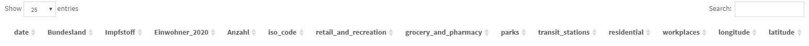

# Beschreibung
Bei der Auslieferung des Projektes handelt es sich um eine Shiny-App. Diese unterteilt sich in drei Bereiche:

- Slider

- Karte

- Datentabelle

Bei dem Slider handelt es sich um eine Einstellmöglichkeit welcher Monat betrachtet werden soll. Die Karte sowie die Tabelle passen sich dem eingegebenen Monat an.



Die Karte zeigt die `Anzahl` an geimpfter Personen. Ebenfall lassen sich am linken Rand der Karte die verschiedenen Moblilitätswerte einblenden. Diese geben dann auf der Karte zusätzlich an, wie sich die Mobilität verändert hat.



Die Datentabelle beinhaltet alle relevanten Daten welche auf der Karte zu sehen sind. Das soll ermöglichen sich die einzelnen Werte im Detail anzusehen.



# Bibliotheken
```{r shiny_bibs, eval=FALSE}
#load libraries
library(shiny)
library(leaflet)
library(dplyr)
library(leaflet.extras)
library(leaflet.extras2)
library(shinydashboard)
library(sf)
library(geojsonsf)
library(tidyverse)
library(lubridate)
```


# Datenvorbereitung
Der erste Schritt in der Datenaufbereitung (für Shiny) besteht darin, die Daten einzulesen und eine Spalte für den Monat zu generieren. Diese Spalte wird später als Filterspalte für den eingestellten Monat des Sliders fungieren. 

```{r data_prep_shiny_1, eval=FALSE}
data <- read.csv('../Website/Daten_Output/Mobility_vaccine.csv')
data$month <- month(as.POSIXct(data$date,format="%Y-%m-%d"))
```

Im zweiten Schritt werden die GPS koordinaten ergänzt. Hierfür wurde der `iso_code` der Bundesländer verwendet um deren Hauptstädte als Referenzpunkte zu verwenden.

```{r data_prep_shiny_2, eval=FALSE}
data$longitude <- ifelse(data$iso_code == 'DE-BW', 9.183333, 
                         ifelse(data$iso_code == 'DE-BE', 13.404954, 
                                ifelse(data$iso_code == 'DE-BB', 13.063561, 
                                       ifelse(data$iso_code == 'DE-HE', 8.239761, 
                                              ifelse(data$iso_code == 'DE-MV', 11.41316, 
                                                     ifelse(data$iso_code == 'DE-SL', 7.000000, 
                                                            ifelse(data$iso_code == 'DE-SH', 10.139444, 
                                                                   ifelse(data$iso_code == 'DE-BY', 11.581981, 
                                                                          ifelse(data$iso_code == 'DE-HH', 9.993682, 
                                                                                 ifelse(data$iso_code == 'DE-HB', 8.8016937, 
                                                                                        ifelse(data$iso_code == 'DE-NI', 9.7320104, 
                                                                                               ifelse(data$iso_code == 'DE-NW', 6.7734556, 
                                                                                                      ifelse(data$iso_code == 'DE-RP', 8.2472526, 
                                                                                                             ifelse(data$iso_code == 'DE-SN', 13.7372621, 
                                                                                                                    ifelse(data$iso_code == 'DE-ST', 11.6276237, 
                                                                                                                           ifelse(data$iso_code == 'DE-TH', 11.0298799, 0))))))))))))))))
data$latitude <- ifelse(data$iso_code == 'DE-BW', 48.783333, 
                        ifelse(data$iso_code == 'DE-BE', 52.520008, 
                               ifelse(data$iso_code == 'DE-BB', 52.391842, 
                                      ifelse(data$iso_code == 'DE-HE', 50.078217, 
                                             ifelse(data$iso_code == 'DE-MV', 53.62937, 
                                                    ifelse(data$iso_code == 'DE-SL', 	49.233334, 
                                                           ifelse(data$iso_code == 'DE-SH', 54.323334, 
                                                                  ifelse(data$iso_code == 'DE-BY', 48.135125, 
                                                                         ifelse(data$iso_code == 'DE-HH', 53.551085, 
                                                                                ifelse(data$iso_code == 'DE-HB', 53.0792962, 
                                                                                       ifelse(data$iso_code == 'DE-NI', 52.3758916, 
                                                                                              ifelse(data$iso_code == 'DE-NW', 51.2277411, 
                                                                                                     ifelse(data$iso_code == 'DE-RP', 49.9928617, 
                                                                                                            ifelse(data$iso_code == 'DE-SN', 51.0504088, 
                                                                                                                   ifelse(data$iso_code == 'DE-ST', 52.1205333, 
                                                                                                                          ifelse(data$iso_code == 'DE-TH', 50.9847679, 0))))))))))))))))

```


# Shiny-App
Wenn die Daten vorbereitet sind, kommt der eigentliche Hauptteil der Shiny-App. Diese besteht aus zwei unterschiedlichen Komponenten. Zum einen das `UI` und zum anderen der `Server`. Im `UI` wird alles definiert was der User als Interface zu sehen bekommt. Das bedeutet, hier wird das Layout festgelegt und welcher Inhalt an welchen Stellen angezeigt wird. Der `Server` wird später definiert und hat nur die Aufgabe die einzelnen Teile, welche im `UI` definiert wurden mit Inhalt zu füllen. Diese Trennung ermöglicht es in einer Web-Applikation die Daten von dem Frontend zu trennen und beide Teile seperat zu betreiben. Bei unserem Usecase ist dies jedoch nicht relevant. Deshalb befinden sich beide Teile an der gleichen Stelle. 

## UI
Das `UI` unterteilt sich, wie in der Beschreibung angegeben, in drei Teile. Diese Unterteilung spiegelt sich auch im Code wieder. Am Anfang wird der `dashboardheader` definiert. Dieser beginnt links oben und definiert den Startpunkt. Er umfasst die gesamte Seite. In seinem Inneren wird dann zum einen die `dashboardSidebar` sowie der `dashboardBody` eingebettet. 
Die Slidebar wiederum enthält den Slider welcher sich über eine Strecke von `1 - 12` verschieben lässt.
Der Body beinhaltet die Karte als zentrales Objekt gefolgt von der Tabelle. Hierfür werden die Größe sowie ein Name für die Karte vergeben damit der `Server` später weiß über welchen Namen dieser die Karte findet. Ebenfalls werden die `checkboxen` hier vordefiniert. Die Tabelle bekommt ebenso einen Namen damit auf sie zugegriffen werden kann.

```{r shiny_ui, eval=FALSE}
ui <- dashboardPage(dashboardHeader(title='Impfauswertung'),
                    dashboardSidebar(sliderInput(
                      "months",
                      "Month:",
                      min = 1,
                      max = 12,
                      value = 1
                    )),
                    dashboardBody(
                      fluidPage(
                        mainPanel(
                          leafletOutput(
                            outputId = "map",
                            height = 600,
                            width = 1500
                          ),
                          # checks on the map for Mobility
                          absolutePanel(
                            top = 70,
                            left = 20,
                            checkboxInput("parks", "Parks", FALSE),
                            checkboxInput("retail", "Retail", FALSE),
                            checkboxInput("work", "Arbeitsplatz", FALSE),
                            checkboxInput("residential", "Wohnbezirke", FALSE),
                            checkboxInput("grocery", "Einkaufszentren", FALSE),
                            checkboxInput("transit", "Verkehr", FALSE),
                            
                          )
                        ),
                        tabsetPanel(
                          id = 'df',
                          br(),
                          tabPanel(dataTableOutput('table'))
                        )
                        
                      )))
```


## Server
Im `Server` wurde der Code definiert welcher alle Komponenten im `UI` mit Leben befüllt. Dies gilt für Daten sowie für Funktionen gleichermaßen. Die Reihenfolge spielt dabei keine Rolle da die jeweiligen Codeteile separat angefragt werden sollten sie im `UI` benötigt werden. Das bedeutet zum Beispiel, dass die Karte immer befüllt wird aber die `checkboxen` nur Anwendung finden wenn der Nutzer diese anklickt.

Im ersten Teil wird eine Farbpalette angelegt. Diese dient später als Farbinput für die `checkboxen`.
```{r shiny_server_color, eval=FALSE}
#Color for Mobility
pal2 <- colorFactor(
  palette = c('blue', 'yellow', 'red'),
  domain = data$parks
)
```

Im zweitet Teil wird der Inhalt der Tabelle definiert. Sie richtet sich ebenfalls nach den Eingaben des Nutzers anhand des Sliders. Aus diesem Grund werden die Daten nach Monat gefiltert und nur die relevanten Spalten angezeigt. Id-Spalten oder Filter-Spalten führen keine für den Nutzer wertvolle Daten und schaden der Übersicht.
```{r shiny_server_table, eval=FALSE}
# create the table
output$table <- renderDataTable({data %>% 
    filter((month == input$months) ) %>% 
    select(date, 
           Bundesland, 
           Impfstoff, 
           Einwohner_2020, 
           Anzahl,
           iso_code, 
           retail_and_recreation,
           grocery_and_pharmacy,
           parks,
           transit_stations,
           residential,
           workplaces,
           longitude,
           latitude
    )})
```

Im dritten Teil wird die Karte erstellt. Hierbei handelt es sich um eine Karte aus der Bibliothek `Leaflet`. Nachdem dieser die Daten übergeben wurde befinden sich noch drei weitere Einstellungen auf der Karte. Die erste Einstellung setzt die Ansicht auf Deutschland. Dies wird über Längen- und Breitengrad, sowie über den Zoom gemacht. Die zweite Einstellung legt Tiles auf die Karte und die dritte Einstellung fütg der Karte Kreise hinzu anhand der Daten. Hierbei dient der Längen- und Breitengrad als Position und die Anzahl als Radius der Kreise. Das bedeutet, je größer der Kreis, desto größer die Anzahl.
```{r shiny_server_map, eval=FALSE}
# create the map
output$map <- renderLeaflet({
  leaflet(data) %>% 
    setView(lng = 10, lat = 51, zoom = 5)  %>% 
    addTiles() %>% 
    addCircles(data = data %>% filter(month == input$months), 
               lat = ~ latitude, 
               lng = ~ longitude, 
               weight = 1,
               radius = ~Anzahl, 
               popup = ~as.character(Bundesland), 
               label = ~as.character(paste0("Anzahl: ", sep = " ", Anzahl)), 
               fillOpacity = 0.5
               )
})
```

Im letzten Schritt wird noch die Funktion der `checkboxen` auf der Map hinterlegt. Hierbei dient das Objekt `observe` zur Überwachtung ob der Nutzer auf die Checkbox geklickt hat. Ist dies der Fall, wird der Map ein extra Kreis hinzugefügt welcher die Mobilität beinhalten welche der Nutzer ausgewählt hat. Da es mehrere Mobilitätswerte gibt, wird der folgende Codeausschnitt mehrfach verwendet. Er unterscheidet sich dann nur darin, welche Werte der Kreis anzeigt.
```{r shiny_server_checkbox, eval=FALSE}
# define the checkboxes for the Mobility on the map
observe({
  proxy <- leafletProxy("map", data = data %>% filter(month == input$months))
  proxy %>% clearMarkers()
  if (input$parks) {
    proxy %>% addCircleMarkers(stroke = FALSE, color = ~pal2(parks), fillOpacity = 0.1, label = ~as.character(paste0("Parks: ", sep = " ", parks)))}
  else {
    proxy %>% clearMarkers() %>% clearControls()
  }
})
```

## Start der Shiny-App
Die Shiny-App kann im Anschluss ausgeführt werden. Der komplette Code befindet sich im Shiny-Projekt.
```{r shiny_app_start, eval=FALSE}
# Run the application
shinyApp(ui = ui, server = server)
```

